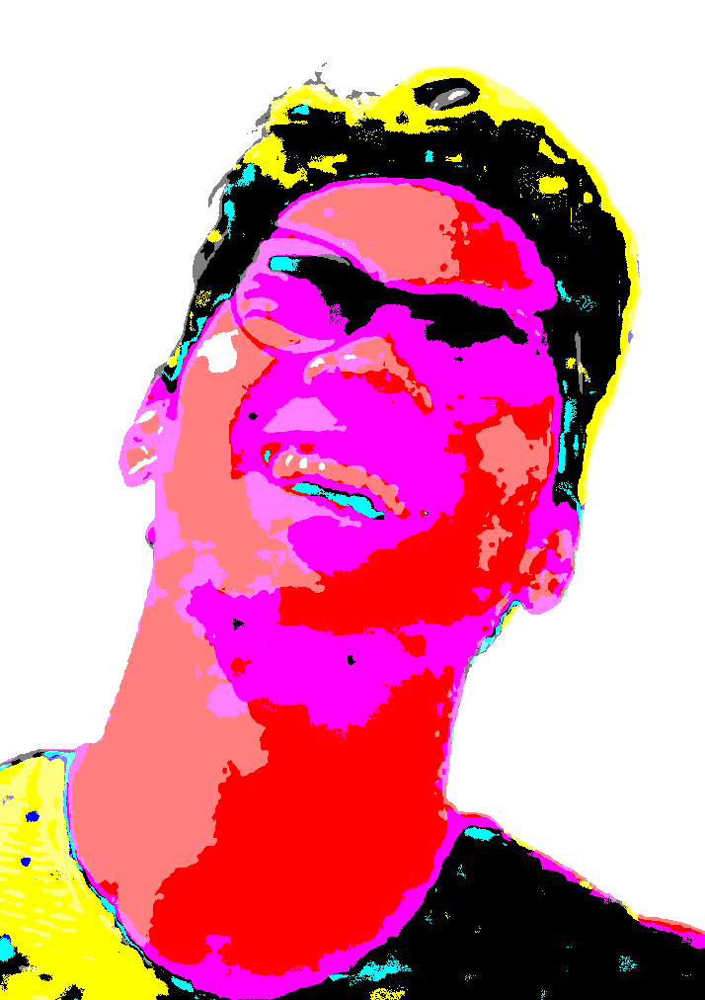

<!-- PROJECT LOGO -->
<br />
<p align="center">
  <a href="https://github.com/nicklamyeeman/face_drawer">
    
  </a>

  <h3 align="center">FACE DRAWER</h3>

  <p align="center">
    Transform any picture with only primary colors
    <br />
    <a href="https://github.com/nicklamyeeman/face_drawer"><strong>Explore the docs »</strong></a>
    <br />
    <br />
    <a href="https://github.com/nicklamyeeman/face_drawer/issues">Report Bug</a>
    ·
    <a href="https://github.com/nicklamyeeman/face_drawer/issues">Request Feature</a>
  </p>
</p>


<!-- TABLE OF CONTENTS -->
## Table of Contents

* [About the Project](#about-the-project)
  * [Built With](#built-with)
* [Getting Started](#getting-started)
  * [Prerequisites](#prerequisites)
  * [Installation](#installation)
* [Roadmap](#roadmap)
* [Contributing](#contributing)
* [Contact](#contact)
* [Acknowledgements](#acknowledgements)


<!-- ABOUT THE PROJECT -->
## About The Project

This project is for an art assignment in Keimyung University. In the course "Studio Mixx (2)", I was asked about my identity, and visualize it specially.
Being a developer and a programmer student for 4 years now, the best way to identify myself is about being a developer, not an artist.

I'm kind of an artist myself because being an artist is not about doing great art, it's about being enough stupid to continue. That's why I'm an artistic programmer.

### Built With

* [SFML](https://www.sfml-dev.org/)


<!-- GETTING STARTED -->
## Getting Started

To get a local copy up and running follow these simple steps.

### Prerequisites

Be sure you have SFML installed on your PC, then open a terminal

### Installation

1. Clone the repo
```sh
git clone https://github.com/nicklamyeeman/face_drawer.git
```
2. Compile it
```sh
make
```


<!-- ROADMAP -->
## Roadmap

See the [open issues](https://github.com/nicklamyeeman/face_drawer/issues) for a list of proposed features (and known issues).


<!-- CONTRIBUTING -->
## Contributing

Contributions are what make the open source community such an amazing place to be learn, inspire, and create. Any contributions you make are **greatly appreciated**.

1. Fork the Project
2. Create your Feature Branch (`git checkout -b feature/AmazingFeature`)
3. Commit your Changes (`git commit -m 'Add some AmazingFeature'`)
4. Push to the Branch (`git push origin feature/AmazingFeature`)
5. Open a Pull Request


<!-- CONTACT -->
## Contact

Your Name - [@nickauteen](https://twitter.com/nickauteen) - nick.lam-yee-man@epitech.eu

Project Link: [https://github.com/nicklamyeeman/face_drawer](https://github.com/nicklamyeeman/face_drawer)


<!-- ACKNOWLEDGEMENTS -->
## Acknowledgements

* [Best-README Template](https://github.com/othneildrew/Best-README-Template)


<!-- MARKDOWN LINKS & IMAGES -->
<!-- https://www.markdownguide.org/basic-syntax/#reference-style-links -->
[contributors-shield]: https://img.shields.io/github/contributors/nicklamyeeman/repo.svg?style=flat-square
[contributors-url]: https://github.com/nicklamyeeman/repo/graphs/contributors
[forks-shield]: https://img.shields.io/github/forks/nicklamyeeman/repo.svg?style=flat-square
[forks-url]: https://github.com/nicklamyeeman/repo/network/members
[stars-shield]: https://img.shields.io/github/stars/nicklamyeeman/repo.svg?style=flat-square
[stars-url]: https://github.com/nicklamyeeman/repo/stargazers
[issues-shield]: https://img.shields.io/github/issues/nicklamyeeman/repo.svg?style=flat-square
[issues-url]: https://github.com/nicklamyeeman/repo/issues
[license-shield]: https://img.shields.io/github/license/nicklamyeeman/repo.svg?style=flat-square
[license-url]: https://github.com/nicklamyeeman/repo/blob/master/LICENSE.txt
[linkedin-shield]: https://img.shields.io/badge/-LinkedIn-black.svg?style=flat-square&logo=linkedin&colorB=555
[linkedin-url]: https://linkedin.com/in/nicklamyeeman
[product-screenshot]: images/screenshot.png
